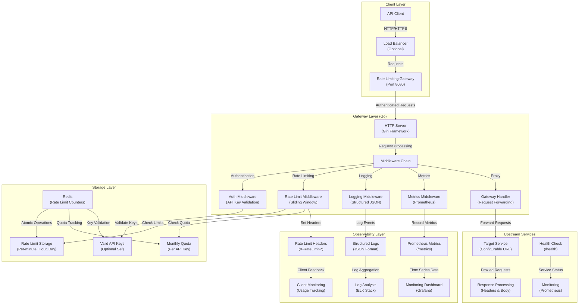
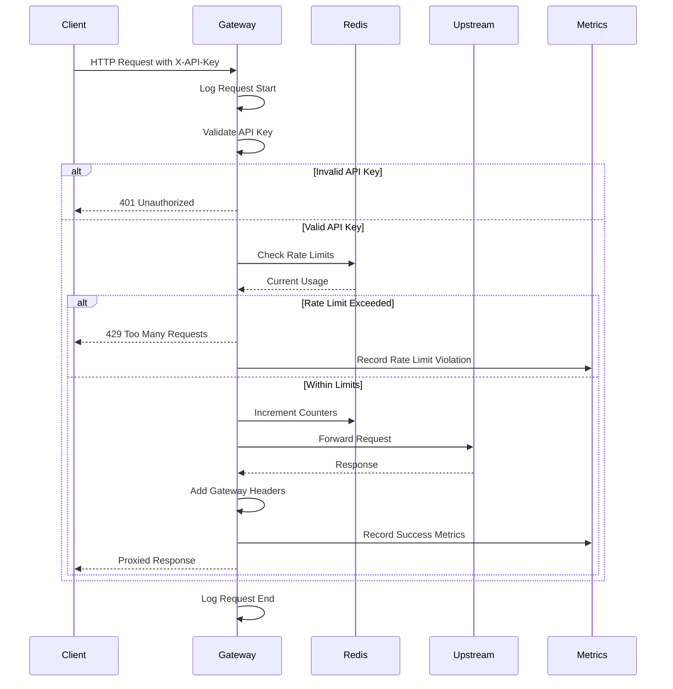
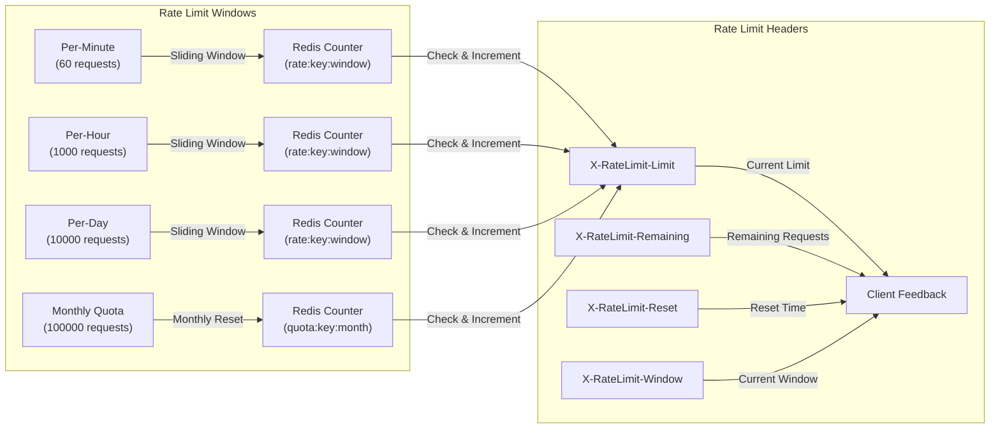

# FlowGuard

A production-grade rate limiting and API gateway service built in Go. This service acts as a reverse proxy that enforces rate limits, validates API keys, and forwards requests to upstream services with comprehensive monitoring and observability.

---

## Architecture



---

## System Overview

The Rate Limiting API Gateway implements a high-performance, distributed architecture with clear separation of concerns across five main layers:

### **Client Layer**

- **API Clients**: External applications making requests to protected services
- **Load Balancer**: Optional reverse proxy for high availability and SSL termination
- **Request Routing**: Intelligent routing based on API keys and rate limits

### **Gateway Layer**

- **HTTP Server**: Gin-based web server with graceful shutdown and health checks
- **Middleware Chain**: Modular middleware for authentication, rate limiting, logging, and metrics
- **Authentication**: API key validation with Redis-based key storage
- **Rate Limiting**: Multi-level rate limiting (minute, hour, day, monthly quota)
- **Request Proxy**: Intelligent forwarding with header preservation and error handling

### **Storage Layer**

- **Redis**: High-performance in-memory storage for rate limit counters and quotas
- **Atomic Operations**: Redis pipelines for consistent rate limit increments
- **Distributed Storage**: Shared state across multiple gateway instances
- **Key Management**: Optional Redis set for valid API key validation

### **Upstream Services**

- **Target Services**: Configurable upstream services (APIs, microservices, etc.)
- **Response Processing**: Header preservation and gateway-specific header injection
- **Error Handling**: Comprehensive error handling with appropriate HTTP status codes
- **Timeout Management**: Configurable timeouts for upstream service calls

### **Observability Layer**

- **Prometheus Metrics**: Comprehensive metrics for monitoring and alerting
- **Structured Logging**: JSON-formatted logs with request/response details
- **Rate Limit Headers**: Client-facing headers for rate limit status
- **Health Checks**: Built-in health check endpoints for load balancers

The system supports multiple deployment patterns:

1. **Single Instance**: Direct deployment for development and testing
2. **Load Balanced**: Multiple instances behind a load balancer
3. **Kubernetes**: Containerized deployment with horizontal scaling
4. **Docker Compose**: Local development with Redis and optional upstream services

---

## Data Flow



---

## Rate Limiting Strategy



---

## Features

- **🔐 API Key Authentication**: Secure API key validation with Redis-based storage
- **⚡ Multi-Level Rate Limiting**: Per-minute, per-hour, per-day, and monthly quota enforcement
- **📊 Comprehensive Monitoring**: Prometheus metrics for requests, rate limits, and upstream errors
- **📝 Structured Logging**: JSON-formatted logs with request details and API key masking
- **🏥 Health Checks**: Built-in health check endpoints for load balancer integration
- **🔄 Request Proxy**: Intelligent request forwarding with header preservation
- **🎯 Rate Limit Headers**: Client-facing headers for rate limit status and reset times
- **🚀 High Performance**: Redis-based distributed rate limiting with atomic operations
- **🐳 Docker Support**: Complete containerization with multi-stage builds
- **☸️ Kubernetes Ready**: Production-ready deployment with health checks and graceful shutdown
- **🔧 Configurable**: Environment-based configuration for all settings
- **🧪 Comprehensive Testing**: Unit tests with mocking and integration tests
- **📈 Observability**: Metrics, logs, and rate limit information endpoints

---

## 🚀 Features

- **API Key Authentication**: Validates API keys via headers
- **Multi-level Rate Limiting**: Per-minute, per-hour, per-day, and monthly quotas
- **Redis-based Storage**: Fast, distributed rate limiting with Redis
- **Request Logging**: Comprehensive request/response logging with structured JSON
- **Prometheus Metrics**: Built-in metrics for monitoring and alerting
- **Health Checks**: Built-in health check endpoints
- **Docker Support**: Complete Docker and Docker Compose setup
- **Production Ready**: Graceful shutdown, error handling, and security best practices

## 🏗️ Architecture

```
┌────────────┐
│   Client   │
└─────┬──────┘
      ▼
┌────────────┐
│  API Key   │
│ Validation │
└─────┬──────┘
      ▼
┌────────────────────┐
│ Rate Limiter (Go)  │
└─────┬──────┬───────┘
      ▼      ▼
   Cache ✅   Quota ✅
      ▼
     Forward ✅
  ┌──────────────────┐
  │  Target Service  │
  └──────────────────┘
```

## 📦 Project Structure

```
rate-limiting-gateway/
├── cmd/
│   └── main.go                 # Application entry point
├── internal/
│   ├── config/
│   │   └── config.go          # Configuration management
│   ├── handlers/
│   │   ├── gateway.go         # HTTP handlers
│   │   └── gateway_test.go    # Handler tests
│   ├── limiter/
│   │   ├── limiter.go         # Rate limiting logic
│   │   └── interface.go       # Rate limiter interface
│   ├── middleware/
│   │   ├── auth.go            # API key authentication
│   │   ├── rate_limit.go      # Rate limiting middleware
│   │   └── logging.go         # Request logging
│   ├── metrics/
│   │   └── metrics.go         # Prometheus metrics
│   └── storage/
│       └── redis.go           # Redis operations
├── tests/
│   └── integration_test.go    # Integration tests
├── Dockerfile                  # Multi-stage Docker build
├── docker-compose.yml          # Local development setup
├── config.env                  # Environment configuration
├── Makefile                    # Development tasks
├── go.mod                      # Go module dependencies
├── .gitignore                  # Git ignore rules
└── README.md                   # This file
```

## 🛠️ Installation & Setup

### Prerequisites

- Go 1.23+
- Redis 6.0+
- Docker & Docker Compose (optional)

### Local Development

1. **Clone the repository**

   ```bash
   git clone <repository-url>
   cd rate-limiting-gateway
   ```

2. **Install dependencies**

   ```bash
   go mod download
   ```

3. **Start Redis**

   ```bash
   # Using Docker
   docker run -d --name redis -p 6379:6379 redis:7-alpine

   # Or using docker-compose
   docker-compose up redis -d
   ```

4. **Set environment variables**

   ```bash
   # Copy the example config
   cp config.env .env

   # Edit as needed
   nano .env
   ```

5. **Run the application**

   ```bash
   go run cmd/main.go
   ```

### Using Docker Compose

1. **Start all services**

   ```bash
   docker-compose up -d
   ```

2. **Check service status**

   ```bash
   docker-compose ps
   ```

3. **View logs**

   ```bash
   docker-compose logs -f gateway
   ```

## 🔧 Configuration

The application is configured via environment variables:

| Variable                   | Default              | Description             |
| -------------------------- | -------------------- | ----------------------- |
| `SERVER_PORT`              | `8080`               | HTTP server port        |
| `REDIS_ADDR`               | `localhost:6379`     | Redis server address    |
| `REDIS_PASSWORD`           | ``                   | Redis password (if any) |
| `RATE_LIMIT_PER_MINUTE`    | `60`                 | Requests per minute     |
| `RATE_LIMIT_PER_HOUR`      | `1000`               | Requests per hour       |
| `RATE_LIMIT_PER_DAY`       | `10000`              | Requests per day        |
| `RATE_LIMIT_MONTHLY_QUOTA` | `100000`             | Monthly request quota   |
| `TARGET_URL`               | `http://httpbin.org` | Upstream service URL    |
| `LOG_LEVEL`                | `info`               | Logging level           |
| `LOG_JSON`                 | `true`               | Use JSON logging format |

## 📡 API Endpoints

### Health Check

```http
GET /health
```

Returns service health status.

### Metrics

```http
GET /metrics
```

Returns Prometheus metrics.

### Rate Limit Info

```http
GET /api/rate-limit-info
Header: X-API-Key: your-api-key
```

Returns current rate limit information for the API key.

### Proxy (Main Gateway)

```http
ANY /proxy/*
Header: X-API-Key: your-api-key
```

Forwards requests to the upstream service with rate limiting.

## 🔑 API Key Authentication

All requests to protected endpoints must include an `X-API-Key` header:

```bash
curl -H "X-API-Key: your-api-key" http://localhost:8080/proxy/get
```

## 📊 Rate Limiting

The gateway enforces multiple rate limiting levels:

- **Per-minute**: 60 requests (configurable)
- **Per-hour**: 1,000 requests (configurable)
- **Per-day**: 10,000 requests (configurable)
- **Monthly quota**: 100,000 requests (configurable)

When rate limits are exceeded, the service returns:

- HTTP 429 (Too Many Requests)
- Rate limit headers with reset times
- Detailed error response

### Rate Limit Headers

```
X-RateLimit-Limit: 60
X-RateLimit-Remaining: 45
X-RateLimit-Reset: 2024-01-01T12:01:00Z
X-RateLimit-Window: minute
X-RateLimit-QuotaUsed: 5000
X-RateLimit-QuotaLimit: 100000
```

## 📈 Monitoring

### Prometheus Metrics

The service exposes Prometheus metrics at `/metrics`:

- `gateway_requests_total`: Total requests processed
- `gateway_request_duration_seconds`: Request duration
- `gateway_rate_limit_exceeded_total`: Rate limit violations
- `gateway_upstream_errors_total`: Upstream service errors

### Logging

Structured JSON logging includes:

- Request method, path, and status
- API key (masked)
- Response time and size
- Rate limit information
- Error details

## 🧪 Testing

Run the test suite:

```bash
go test ./...
```

Run tests with coverage:

```bash
go test -cover ./...
```

## 🚀 Production Deployment

### Docker

Build the image:

```bash
docker build -t rate-limiting-gateway .
```

Run the container:

```bash
docker run -d \
  --name gateway \
  -p 8080:8080 \
  -e REDIS_ADDR=redis:6379 \
  -e TARGET_URL=https://api.example.com \
  rate-limiting-gateway
```

### Kubernetes

Example deployment:

```yaml
apiVersion: apps/v1
kind: Deployment
metadata:
  name: rate-limiting-gateway
spec:
  replicas: 3
  selector:
    matchLabels:
      app: rate-limiting-gateway
  template:
    metadata:
      labels:
        app: rate-limiting-gateway
    spec:
      containers:
        - name: gateway
          image: rate-limiting-gateway:latest
          ports:
            - containerPort: 8080
          env:
            - name: REDIS_ADDR
              value: "redis-service:6379"
            - name: TARGET_URL
              value: "https://api.example.com"
```

## 🔒 Security Considerations

- API keys are masked in logs and metrics
- Non-root user in Docker container
- Graceful shutdown handling
- Input validation and sanitization
- Rate limiting prevents abuse

## 🤝 Contributing

1. Fork the repository
2. Create a feature branch
3. Make your changes
4. Add tests
5. Submit a pull request

## 📄 License

This project is licensed under the MIT License - see the LICENSE file for details.

## 🆘 Support

For issues and questions:

- Create an issue on GitHub
- Check the logs for debugging information
- Verify Redis connectivity
- Test with the health check endpoint

---

**Built with ❤️ using Go, Gin, Redis, and Prometheus**
