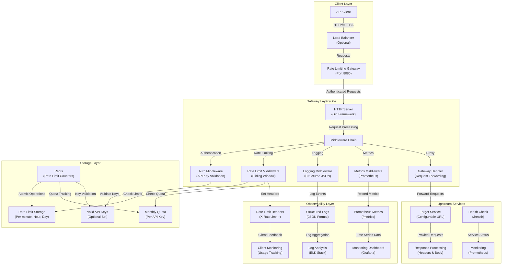
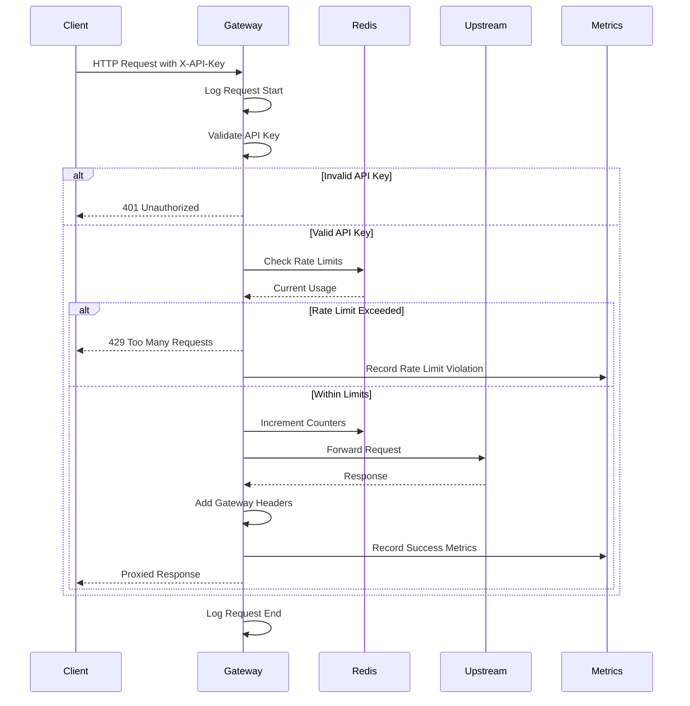
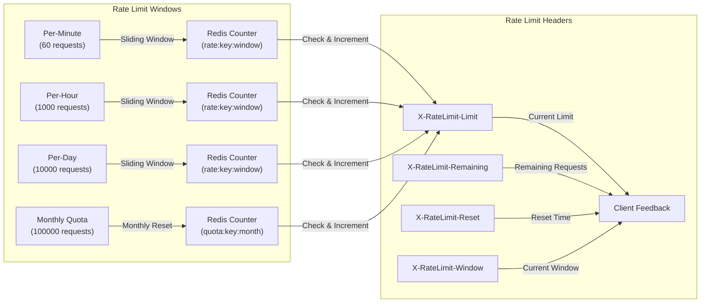

# FlowGuard

A rate limiting and API gateway service built in Go. Acts as a reverse proxy that enforces rate limits, validates API keys, and forwards requests to upstream services with comprehensive monitoring and observability.

---

## Architecture

---

## System Overview

The Rate Limiting API Gateway implements a high-performance, distributed architecture with clear separation of concerns across five main layers:

### **Client Layer**

- **API Clients**: External applications making requests to protected services
- **Load Balancer**: Optional reverse proxy for high availability and SSL termination
- **Request Routing**: Intelligent routing based on API keys and rate limits

### **Gateway Layer**

- **HTTP Server**: Gin-based web server with graceful shutdown and health checks
- **Middleware Chain**: Modular middleware for authentication, rate limiting, logging, and metrics
- **Authentication**: API key validation with Redis-based key storage
- **Rate Limiting**: Multi-level rate limiting (minute, hour, day, monthly quota)
- **Request Proxy**: Intelligent forwarding with header preservation and error handling

### **Storage Layer**

- **Redis**: High-performance in-memory storage for rate limit counters and quotas
- **Atomic Operations**: Redis pipelines for consistent rate limit increments
- **Distributed Storage**: Shared state across multiple gateway instances
- **Key Management**: Optional Redis set for valid API key validation

### **Upstream Services**

- **Target Services**: Configurable upstream services (APIs, microservices, etc.)
- **Response Processing**: Header preservation and gateway-specific header injection
- **Error Handling**: Comprehensive error handling with appropriate HTTP status codes
- **Timeout Management**: Configurable timeouts for upstream service calls

### **Observability Layer**

- **Prometheus Metrics**: Comprehensive metrics for monitoring and alerting
- **Structured Logging**: JSON-formatted logs with request/response details
- **Rate Limit Headers**: Client-facing headers for rate limit status
- **Health Checks**: Built-in health check endpoints for load balancers

The system supports multiple deployment patterns:

1. **Single Instance**: Direct deployment for development and testing
2. **Load Balanced**: Multiple instances behind a load balancer
3. **Kubernetes**: Containerized deployment with horizontal scaling
4. **Docker Compose**: Local development with Redis and optional upstream services

---

## Data Flow

---

## Rate Limiting Strategy

---

## Features

- **API Key Authentication**: Secure API key validation with Redis-based storage
- **Multi-Level Rate Limiting**: Per-minute, per-hour, per-day, and monthly quota enforcement
- **Comprehensive Monitoring**: Prometheus metrics for requests, rate limits, and upstream errors
- **Structured Logging**: JSON-formatted logs with request details and API key masking
- **Health Checks**: Built-in health check endpoints for load balancer integration
- **Request Proxy**: Intelligent request forwarding with header preservation
- **Rate Limit Headers**: Client-facing headers for rate limit status and reset times
- **High Performance**: Redis-based distributed rate limiting with atomic operations
- **Docker Support**: Complete containerization with multi-stage builds
- **Kubernetes Ready**: Production-ready deployment with health checks and graceful shutdown
- **Configurable**: Environment-based configuration for all settings
- **Comprehensive Testing**: Unit tests with mocking and integration tests
- **Observability**: Metrics, logs, and rate limit information endpoints
